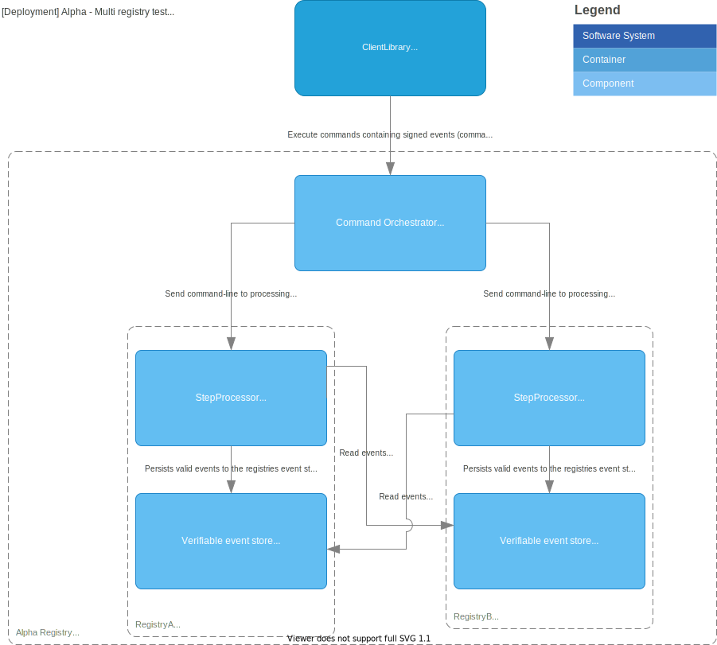

# Architecture

This file contains the run though of the suggested architecture for the registry.

## Glossary

- **Commands**: are a request to the registry to perform a state change, it is signed by the owner of the item to perform changes upon.
- **Events**: are state changes that has happened and are persisted when they have been included in a merkle tree.
- **Event store**: a datastore that stores all the events for the registry.

## Container diagram

Below is a [Container diagram](https://c4model.com/#ContainerDiagram)
showing a break down of the registry into high level containers as-is.

For in depth description of the containers look in the following documents:

- [Verifiable event store](verifiable_event_store/README.md)
- [Step processor](step_processor/README.md)

## Deployment diagram

