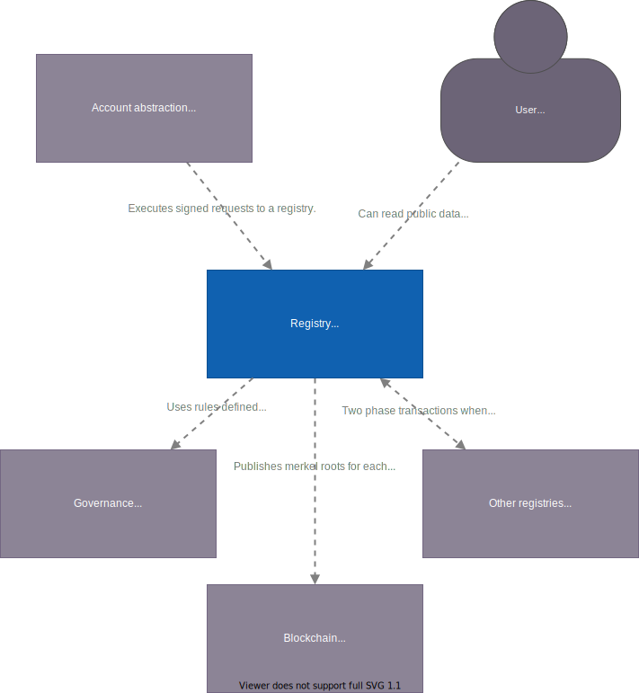

# Architecture

This file contains the run though of the suggested architecture for the registry.

## Glossary

- **Commands**: are a request to the registry to perform a state change, it is signed by the owner of the item to perform changes upon.
- **Events**: are state changes that has happened and are persisted when they have been included in a merkle tree.
- **Event store**: a datastore that stores all the events for the registry.

## Overview

Below is a [system context diagram](https://c4model.com/#SystemContextDiagram)
showing the landscape of systems the registry interacts with.

