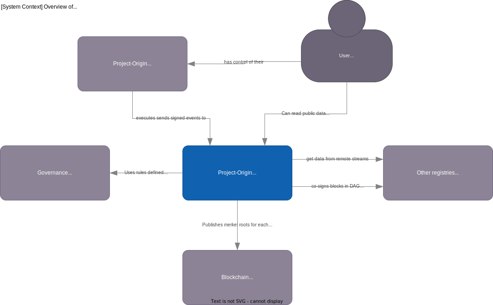

# Architecture

This file contains a run-through of the suggested architecture for the registry.

## Glossary

- **Commands**: are requests to the registry to perform a state change. A command is signed by the owner of the item to perform the change.
- **Events**: are state changes that has happened and are persisted when they have been included in a merkle tree.
- **Event store**: a datastore that stores all the events for the registry.

## Overview

Below is a [system context diagram](https://c4model.com/#SystemContextDiagram)
showing the landscape of systems the registry interacts with.

### What is the registry?

The registry is a system that stores and manages data about the state of the world. The data is stored in the form of events, which are signed by the owner of the data. The registry is a verifiable data store, which means that the data is stored in a merkle tree, and the root of the tree is published to a blockchain. This enables anyone to verify that the data is correct, and that no illegal changes have been made.

### What is a merkle tree?

A merkle tree is a data structure that stores data in a tree, where each leaf is a hash of the data. The root of the tree is a hash of all the leafs. The tree is balanced, which means that the number of leafs is a power of 2. The tree is also ordered, which means that the leafs are ordered in a way that makes it possible to calculate the root of the tree from the leafs.

### The registry is neither strongly typed nor context-aware

The registry is not context-aware, which means that it does not know anything about the data it stores. It is up to the user of the registry to interpret the data. The registry only hashes the data. The registry does not know what the data means, or how it should be interpreted, all it does is to verify provide proofs of the data. 

The reason why the registry is not strongly typed or context aware is that it allows for greater flexibility and applicability across different use cases and industries.

For example, a strongly typed registry would require a specific data schema or format for each type of event being stored, which could be limiting for organizations with diverse data structures. A context-aware registry would also require additional configuration and setup to define the specific context for each use case.

By not being strongly typed or context aware, the registry can be used in a multitude of different contexts without requiring significant customization or configuration. This makes it a more versatile and generic method of implementing traceability.

In addition, the registry provides unique proof of ownership for events added to the event store, and can be used to ease audits from third parties without disclosing the data itself. These benefits remain true regardless of the specific context in which the registry is being used.

Overall, while a strongly typed or context-aware registry may be useful in some specific scenarios, the flexibility and versatility of a more generic registry can make it a more practical solution for many organizations.

