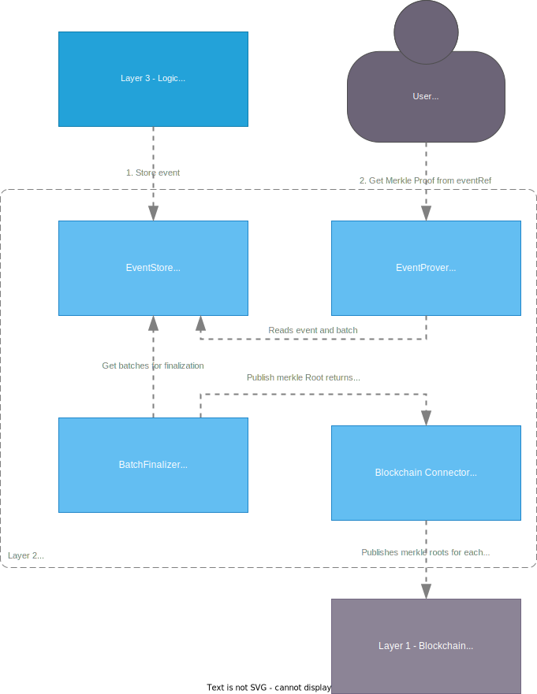

# Verifiable Event Store

The verifiable event store is a container responsible for storing events as public data.

The event store arranges events in a series of merkle-trees, where each root is published to a blockchain. 
Doing so ensures that the data is tamper-proof after the root has been published.

The container also has the responsibility to calculate _MerkleProofs_ requested by users,
with the purpose of verifying that their data is part of the tree.

In the future it should be possible to get all data stored, so one can follow all changes,
and verify that no illegal operations are done.



## Component

### Batcher

The maximum size of the tree, $2^{\text{BatchSizeExponent}}$, can be configured by setting the parameter _BatchSizeExponent_. The tree size is defined as a power of 2 to ensure a balanced-tree. 'A batch is automatically published when events are added beyond the defined maximum size. When a batch is published, a new batch is created to begin collecting subsequent events.

Hashing is done using SHA256.

## Endpoints

### 1. PublishEvent(VerifiableEvent)

Takes a VerifiableEvent to store in the merkle tree,
the batcher ensures that the EventId is unique,
and in sequence.

```protobuf
message VerifiableEvent {
  EventId Id = 1;
  bytes Content = 2;
}

message EventId {
  Uuid EventStreamId = 1;
  uint32 Index = 2;
}
```

### 2. GetMerkleProof(EventId)

Takes an EventId as used in the PublishEvent,
finds the event based on the id, and calculates and returns a MerkleProof,
which enables a user to validate that the event is part of the tree, whose root is published on the blockchain.

```protobuf
message MerkleProof {
  EventId EventId = 1; // id of the event
  bytes Event = 2; // content of the event
  string BlockID = 3; // Blockchain block reference
  string TransactionID = 4; // Blockchain transaction reference
  int64 leafIndex = 5; // leaf number in the tree, zero based.
  repeated string hashes = 6; // Hashes needed to calculate the root based on the event.
}
```
