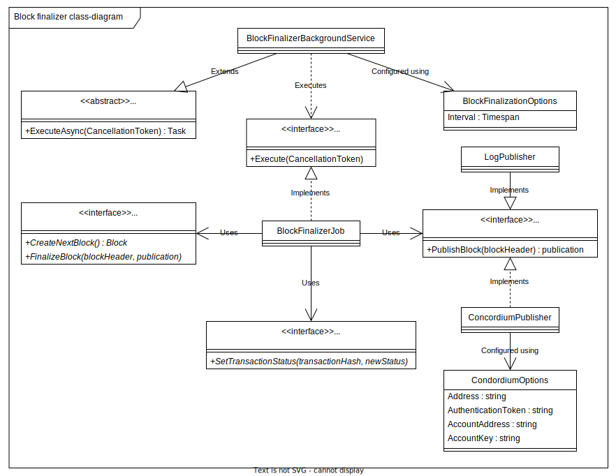

# Block Finalizer

Below is the C4 class-diagram for the block finalizer.

The finalizer is a BackgroundProcess that is requesting the repostory to create the next block.

It then publishes the block using a IBlockPublisher to an immutable log.
After that is finalized, it updates the repository with information about the publication.

Finally it updates all TransationStatus in the cache to Finalized.

## Single process

Only a single instance of the finalizer should be running at any given time,
therefore the background process is only started in server 0 in the stateful.

## Configuration

The finalizer is configured using and BlockFinalizerOptions which has a Interval of type TimeSpan.

This is the interval between each attempt to create a new block.
