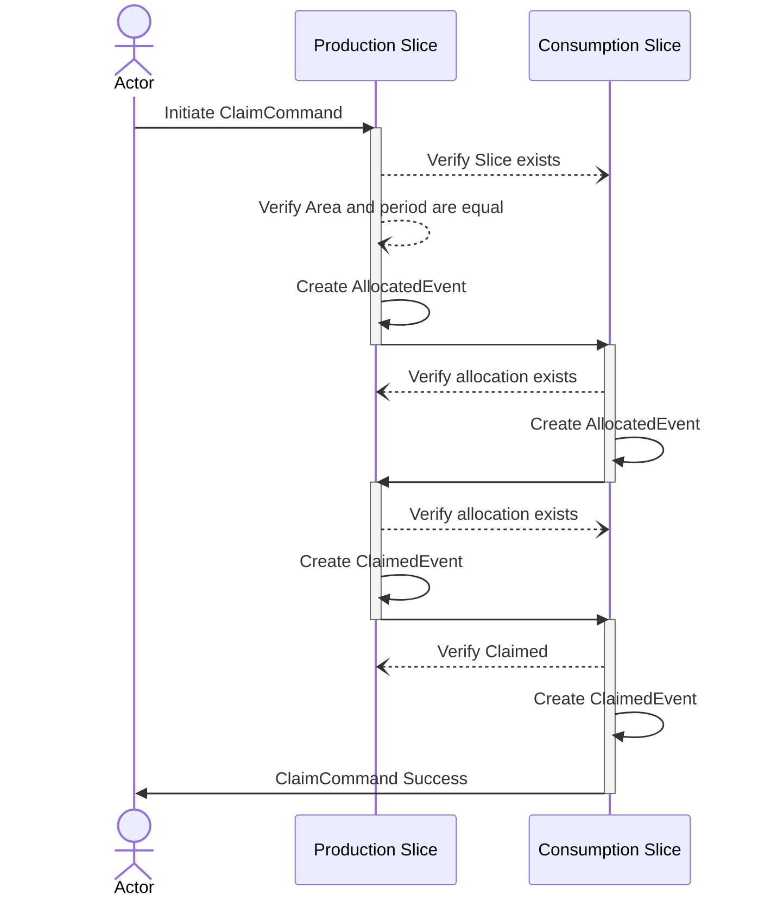

# Claim command

The claim command is where a production and consumption certificate "cancel" each other out.

To use the claim command one has to specify two slices, **one production** and **one consumption**, and they have to be of equal quantity [because of proofs](#privacy-and-zero-knowledge-proofs).

This might require one to perform some slice commands to make them fit together.

Once a claim has been created, it cannot be undone.

## Example

In the example below 3 GCs exists, production-solar, production-wind and Consumption.
A series of commands are then executed:

1. Slice Consumption to ConSlice-A and ConSlice-B
2. Slice Production-Solar to Slice-A and SliceB
3. Claim Slice-B to ConsSlice-A
4. Slice Production-Wind to Slice-C and SliceD
5. Claim Slice-C to ConsSlice-B

<!-- https://sankeymatic.com/build/
Production-Solar [300] Slice-A
Production-Solar [100] Slice-B

Slice-B [100] Claim-Solar
Claim-Solar  [100] ConsSlice-A
ConsSlice-A [100] Consumption

Production-Wind [200] Slice-C

Slice-C [200] Claim-Wind
Claim-Wind  [200] ConSlice-B

Production-Wind [500] Slice-D
ConSlice-B [200] Consumption
 -->

## Privacy and Zero Knowledge proofs

As in the [slice command](slice.md#privacy-and-mathematics), all quantities are hidden using [Pedersen Commitments](../../pedersen-commitments.md) and Zero Knowledge proofs.

The Zero Knowledge proof can prove that the two pedersen-commitments in each slice are equal without revealing the actual numbers.

## Multiple state changes on slices

Because of the nature of the ClaimCommand involving multiple GCs that can exists on any registry,
the ClaimCommand happens in multiple steps involving first creating AllocatedEvents for the slices,
before "committing" the ClaimedEvents to the slices.
When the ClaimedEvent is persisted, the claim has completed.
A "rollback" of AllocatedEvents are still on the drawing board.

## How to

Look at the CommandBuilder for how to perform the [ClaimCommand](xref:ProjectOrigin.Electricity.Client.ElectricityCommandBuilder.ClaimCertificate(ProjectOrigin.Electricity.Client.Models.ShieldedValue,ProjectOrigin.Electricity.Client.Models.FederatedCertifcateId,ProjectOrigin.Electricity.Client.Models.ShieldedValue,Key,ProjectOrigin.Electricity.Client.Models.FederatedCertifcateId,ProjectOrigin.Electricity.Client.Models.ShieldedValue,Key))
