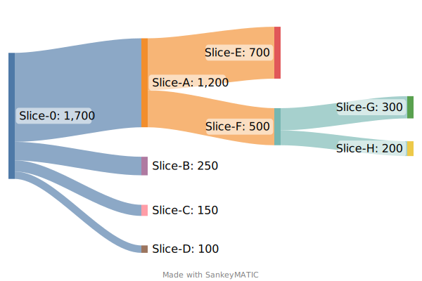

# Slice command

The slice command enables the current owner to create new slices from an existing slice.

The new slices may[^may] be assigned to a new owner as part of the slice command.

[^may]: It is the current owner's choice if they want to transfer it within the command or not.

The **sum** of the new slices are **always equal** to the quantity of the old slice.
When the new slices are created, they become active, and the old slice becomes inactive and is removed.

*NOTE: how the **total** of the new slices are always the same as the source slice. Hence, the total quantity of the non-removed slices on a certificate always stays the same.*

## Example

Below is a Sankey representation of slice that is sliced multiple times:
1. Initially, a single slice (0) is issued with a quantity of 1700Wh.
2. Slice-0 is sliced into 4 slices:
   - Slice-A 1200Wh
   - Slice-B 250Wh
   - Slice-C 150Wh
   - Slice-D 100Wh
3. Slice-A is sliced into 2 slices:
   - Slice-E 700Wh
   - Slice-F 500Wh
4. Slice-F is sliced into 2 slices:
   - Slice-G 300Wh
   - Slice-H 200Wh

<!-- https://sankeymatic.com/build/
Slice-0 [1200] Slice-A

Slice-A [700] Slice-E
Slice-A [500] Slice-F

Slice-F [300] Slice-G
Slice-F [200] Slice-H

Slice-0 [250] Slice-B
Slice-0 [150] Slice-C
Slice-0 [100] Slice-D
-->

## Privacy and mathematics

The example above is a simplification.

The quantity of each slice is encrypted using [Pedersen commitments](../../pedersen-commitments.md).
The Pedersen commitment enables one to prove the quantity stored without causing any changes to the data, and with no data leaking.

A Pedersen commitment is also homomorphic, meaning that one can do operations on the "encrypted data", 
e.g., mathematically prove that the total of the new slices are equal to the old slice (using a Zero-knowledge equality proof), 
without publically revealing the quantities.

The owner of a slice only knows the quantity of their own slice.

> In the example above:
> If I got Slice-A transferred into my account,
> I know I have 1200wh within the GC, but I do not know the total of the GC, only that I have a proveable part of the GC which no-one else can claim the ownership of.
>
> Similarly, if I create slice-F and transfer it to another part,
> I do not know the size of the new slices they might create (G and H) only that they are provably the sum of the 500Wh I transferred.

## How to

Look at the [Slicer](xref:ProjectOrigin.Electricity.Client.Slicer) for information on how to create a SliceCollection,
and the CommandBuilder on how to execute the [SliceCommand](xref:ProjectOrigin.Electricity.Client.ElectricityCommandBuilder.SliceCertificate(ProjectOrigin.Electricity.Client.Models.FederatedCertifcateId,ProjectOrigin.Electricity.Client.Models.SliceCollection,Key))
