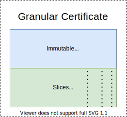
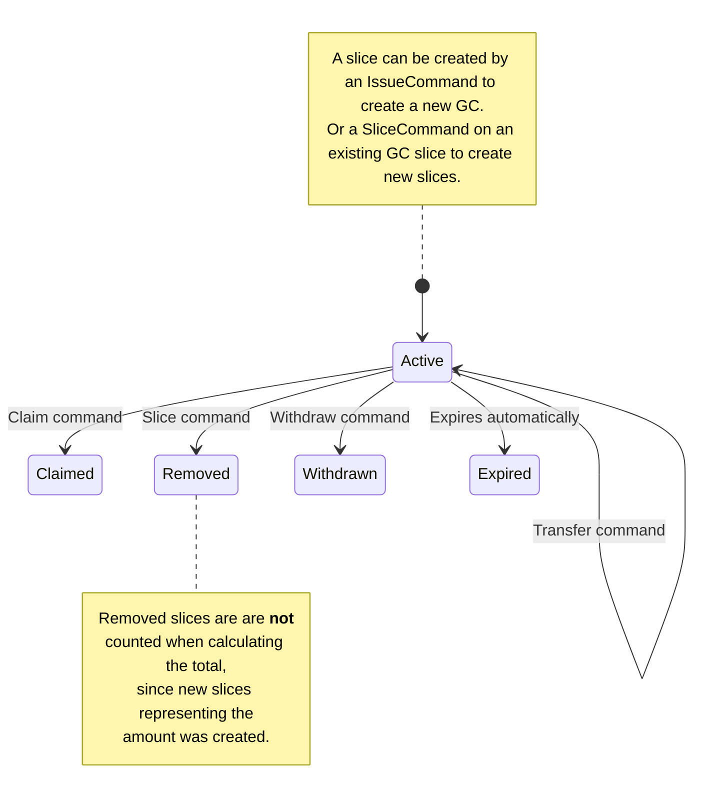

# Granular Certificate

**Granular Certificate** is a term defined by the [EnergyTag Organization](https://energytag.org).

It is a goal at some point for the **ProjectOrigin Registry** to be **Compliant with the EnergyTag Standard**

## Description

In ProjectOrigin, a Granular Certificate (GC) can describe either a **production or consumption** of energy at a meter [^et].

[^et]: In the EnergyTag scheme a GC only relates to the production of energy,
    consumption verification is done with the help of a *consumption verification body*.

A GC consists of two parts:

- A immutable "header" which is the [collection of attributes](attributes.md)
  on the GC. These data **cannot be changed** after the GC has been issued.

  These attributes describe all the properties on the GC,
  like the [grid area](attributes.md#grid-area),
  [period](attributes.md#period)
  and which [meter](attributes.md#gsrn) the GC originates from.

- A collection of [slices](#slices), when a GC is [issued](commands/issue.md),
  it is created with 1 initial slice.

  An active slice contains two values, the **quantity** of the slice, and the **owners public-key**.

  All commands on an existing GC and the life-cycle happens through the slices.

---

## Slices

As described above, a GC is immutable, and contains the entire quantity for the meter for the period,
***so how could trading and claiming parts of a certificate work?***

To solve this ProjectOrigin borrowed a term from the financial sector, refering to **stock-slicing**,
where a single stock can be traded as slices. This happens on top of the existing stock marked.

This was implemented as a core part of the architecture of the GC system in ProjectOrigin.
A GC consists of **1 to n slices**, when the GC is issued, **one initial slice** is created.
Similar to baking a cake, "1 slice (whole cake)" exists.

When a GC is issuied, it is created with an single initial slice.

A slice is always owned by a single public-key.[^public-key]

[^public-key]: Public-private keys was chosen since the registries do not have the concept of accounts and users. Ownership of a GC is purely done with the help of a public-private keypair.
It is up to the integrating system to implement an accounting system and manage ownership through public-private keys.

### Slice life-cycle

A slice has a specific life-cycle, when the slice is created, it becomes **active**.

When a slice changes state, this state is stored on the slice as events.

Note that most commands are final, in there is no way to reverse them once performed.

- [Issue command](commands/issue.md): Used by an **Issuing Body** to issue a new GC.
- [Transfer command](commands/transfer.md): Transfers the ownership of an existing slice to a new owner.
- [Slice command](commands/slice.md): Enables the owner to create any number of new slices from and exsting slice.
- [Claim command](commands/claim.md): Claim a production slice to a consumption slice of same quantity.
- [Withdraw](commands/withdraw.md): Withdraw a GC.
- [Expire](commands/expire.md): Expires old slices.
