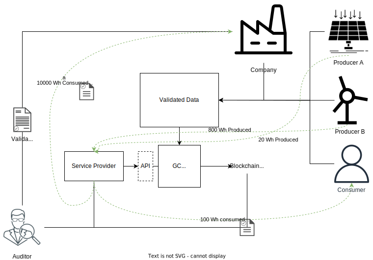
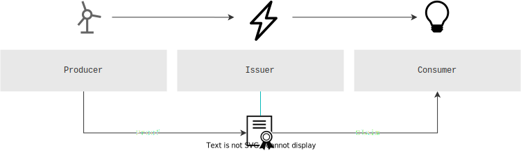

# Overview of Project-Origin

## Certification of Energy
_Why bother at all_? one might ask, and argue that the energy supplied in the socket is electrons and its origin whatever is available at the given time, it is all in the residual mix. _If I want solar or wind specifically I can simply shift my consumption to hours, where there is a high degree of such sources in the residual mix_.  A feasible strategy? Yes. Practical? definitely not.

Leveraging that electricity meters can provide extensive amounts of data - down to an interval of mere minutes - we can separate and document the total amount of electricity provided to the grid at a given time in terms of amounts and their origin at high temporal granularity, on a basis aligned with the spot market. 

Such documentation enables us to design and create a certification system, making it possible for consumers to prove the source of their consumed electricity at specific time intervals. 
This certification system is extremely powerful as it provides trustworthy proofs, and given the [high demand for green energy](https://www2.deloitte.com/content/dam/Deloitte/us/Documents/energy-resources/us-eri-renewable-energy-outlook-2023.pdf) creates incentives to prioritize supply from renewable sources, while effectively preventing greenwashing. 

The scope of a trustworthy certification system as described above, can be useful in markets for various types of  energy. Additionally, a shared technical solution for certification across energy types creates the basis for coupling across sectors by supporting hybrid and Power-to-X technologies.

This is the basis of Project-Origin - creating a trustworthy, secure certification system that can be shared across energy types, by implementing the fundamental technical core functionality. 
The implementation is provided as available open-source software, to allow anyone to use it, and build any necessary functionality on top to create a certification system able to trace their specific resource(s) in transactions.   

## How it has been done so far ?
As the share of renewables in the energy mix of some countries are rising [towards 60%](https://energinet.dk/media/2l5jt3lp/%C3%A5ret-der-gik-2022-i-el-og-gas.pdf), the need for a system to certify the energy supplied in a trustworthy and transparent way becomes increasingly important. 
Currently, certification is done using [Guarantees of Origin](https://en.energinet.dk/Energy-data/Guarantees-of-origin-el-gas-hydrogen/) (GOs), issued on a monthly basis to an electronic register, and can be traded and/or cancelled up to 12 months after being issued. 
This system has been in place for a long time and is generally well understood. 
However, the GO certification scheme has received lots of criticism, especially evolving around the scheme [lacking credibility](https://ieeexplore.ieee.org/abstract/document/5311433), [lacking national implementations of disclosure regulation](https://www.oeko.de/fileadmin/oekodoc/Reliable-Disclosure-in-Europe-Status-Improvements-and-Perspectives.pdf), and having [little to no effect in terms of accelerating investments](https://akjournals.com/view/journals/204/41/4/article-p487.xml?body=contentsummary-24716) in renewable energy production.  
The drawbacks of the GO certification system will be elaborated below. 

### Guarantees of Origin
Guarantees of Origin (GOs) are issued monthly as 1 MWh fixed-volume certificates, which can be traded up to one year after being issued. 
The GO certification system is regulated by the [Renewable Energy Directive](https://energy.ec.europa.eu/topics/renewable-energy/renewable-energy-directive-targets-and-rules/renewable-energy-directive_en) (RED-II).
The rules specifying the format of GOs are provided in the [EN 16325](https://standards.globalspec.com/std/9969735/EN%2016325) standard developed by the European Committee for Standardisation (CEN) and the European Committee for Electrotechnical Standardisation (CENELEC). 

the [Association of Issuing Bodies](https://www.aib-net.org/) (AIB) is the central authority for the GO system in Europe, operating a central hub for trading the certificates following the EN 16325 standard. 

The procedure for trading GOs is as follows:

1. A producer of energy requests a certificate for each MWh of energy produced, and the national issuing body for GO's, compliant with the central authority (AIB), issues the GO(s) to the producer
2. The GO(s) is/are sold to a supplier
3. The supplier sells the GO(s) to a consumer
4. The consumer can then "use" the GO, by [cancelling](https://en.energinet.dk/Energy-data/Guarantees-of-origin-el-gas-hydrogen/#accordion-cancellation), effectively attributing consumption of the renewable energy amount specified by the GO to the consumer.

To summarize, the existing GO system is based on the following principles:
- Yearly certification
- Volume based accounting
- Exchange of certificates between parties through a centralised system 
- The certificate is a tradeable asset
- There is no requirement for a direct physical link between the certificate and the energy supplied

#### Drawbacks
Despite the good concepts behind the GO certification system, it suffers from a number of serious drawbacks. One of these is the very low certificate prices, making it [difficult to generate enough economic incentives](https://www.sciencedirect.com/science/article/abs/pii/S0301421504002423) for improvements and investments in renewable energy production facilities. Another drawback is the property of not to link any physical properties to the certification system, which causes [neglection of transportation costs and over-exploitation of interconnector capacities](https://www.sciencedirect.com/science/article/abs/pii/S0301421516302889). Finally, there have been cases of countries with no physical interconnections [trading GOs](https://akjournals.com/view/journals/204/41/4/article-p487.xml?body=contentsummary-24716). These drawbacks ultimately hinder a trustworthy, transparent documentation of energy consumption and unfortunately don't create the positive impact on further renewable energy investments, as intended.  

## Challenges in the current and future energy grid
At times, certain grid areas experience a supply by renewables that is [bigger than the grid capacity](https://www.caiso.com/documents/curtailmentfastfacts.pdf), which brings a number of [challenges to the existing, physical grid](https://www.rff.org/publications/explainers/renewables-101-integrating-renewables/): 

- It becomes [difficult to stabilize the grid frequency](https://www.engineering.com/story/grid-frequency-stability-and-renewable-power) in the electricity grid.
- Insufficient capacity of the existing grid creates [bottlenecks](https://www.zerohedge.com/energy/grid-bottlenecks-could-derail-europes-renewable-energy-boom), limiting transportation between certain areas 
- [Less centralized load balancing](https://research.rug.nl/en/publications/local-balancing-of-the-electricity-grid-in-a-renewable-municipali) might be necessary 
- Makes it hard to validate the actual energy supplied to power-to-x applications and the origin of the losses in the process

## Strategies for updating the certification system
Several strategies could be applied to the infrastructure to tackle the challenges of the existing system. 

#### Direct infrastructure
Simply adding a direct, physical link between the energy supplied and consumer would be a simple, straightforward solution. 
However, it would require a lot of infrastructure to be rolled out, requiring a lot of material, and investments, making such solution unscalable and expensive. 
Of course, this solution would ensure that the origin of energy is always known, but given the extreme amount of physical infrastructure needed makes it unfeasible.

#### Smaller trading zones
Another strategy would be to divide the trading zones into smaller zones, and then use the energy supplied in each zone across each energy carrier 

#### Granular Certificates

| Description | Method | Organisation | Accounting method |
| --- | --- | --- | --- |
| Guarantees of Origin (GO) | Yearly certification | AIB | MWh (volume based) |
| Granular Certificates | Hourly certification (or less) | Energy Track and Trace / Energytag / etc | Wh (discretely time-based) |

