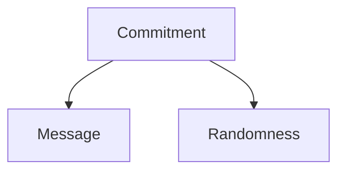
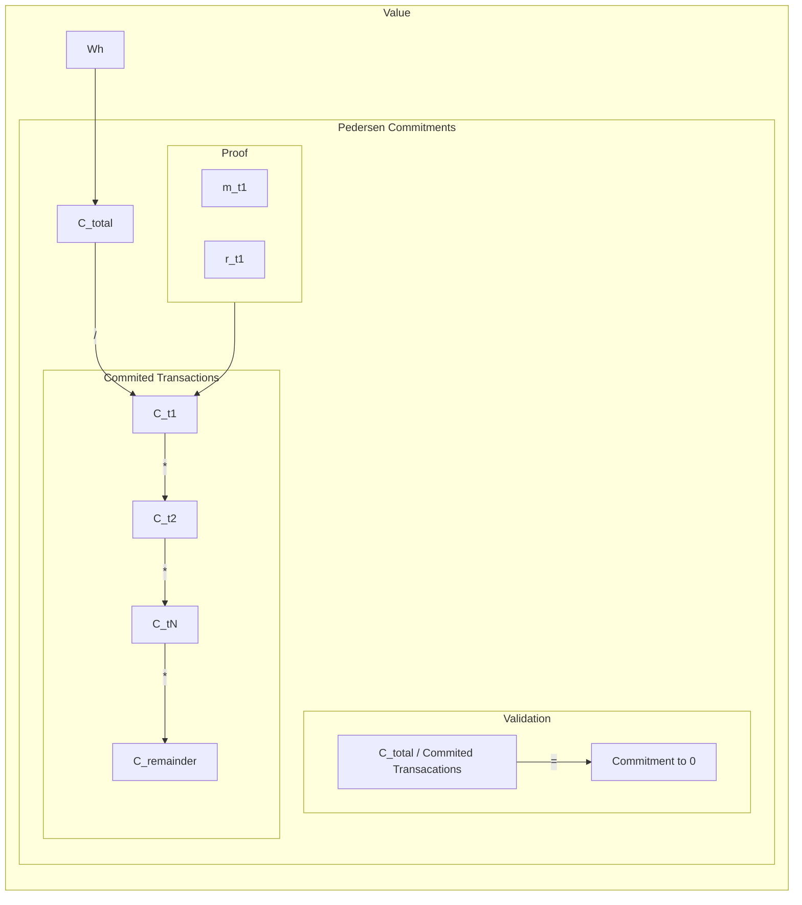

# Pedersen Commitments

In order to obfuscate sensitive data in the certificates to only be accesible and readable to the owner and verifiable to the reciver of the data ie GSRN numbers, quantity of energy that is being transferred, etc, the data is encrypted using Pedersen commitments. The Pedersen commitment is a commitment scheme that allows the holder of the commitment to commit to a value without revealing the value itself. The commitment can be opened to reveal the value. The holder cannot open it to reveal another value. The commitment scheme is homomorphic in the sense that the product of two commitments will be a commitment to the sum of the two values.

## Pedersen commitments are defined as follows:

$$c=C(m,r)$$

|identifier|property|usage|accessability|
|---|---|---|---|
`c` | commitment | the commitment itself | public |
`m` | message | the message that is being committed to | private |
`r` | randomness | the randomness used to commit to the message | private |

### Additional properties of Pedersen commitments

There are commutation and homomorphism properties that are useful for the Pedersen commitment scheme. These properties are defined as follows:

## What these properties can do in practice for Project Origin

The Pedersen commitment scheme is used to obfuscate the quantity of energy that is being transferred. The quantity of energy is encrypted using Pedersen commitments. An additional property is that we can add and subtract hidden quantitys of energy without revealing the individual quantitys to anyone - but you can prove that the result is correct.

## How to prove that a certain value is committed to without revealing the value itself

### Pedersen commitments are used in the following way to obfuscate the quantity of energy that is being transferred:

We want to show that the sum of the commitments in a certificate (e.g. transactions + remainder) is equal to the committed value in the original production certificate, corresponding to a Commitment to 0 `C_total / ( C_t1 + C_t2 + ... + C_tN + C_remainder ) = C´`. `C´` is the commitment to 0.

$$C´= Ctotal / (Ctransactions * Cremainder)$$

The value in a production certificate may be divided up among several owners (several commitments) and there may be several claims. In this case, we want to show that the product of commitments in the first certificate divided by the product of commitments in the second is a `C´` - commitment to 0 (so the sum of energy quantities is the same in the two certificates).

The possible transactions in the certificate are:
|Type|description|
|---|---|
|Transfer|transfer of ownership X quantity of units ie. Wh from user A to B|
|Claim|claim of ownership of production certificate X to consumption certificate Y|
|Expire|expiration of remainder of production certificate|
|Withdraw|withdrawal of remainder of production certificate|

By having unique and random `r` randomness for each transaction, we can prove that the sum of the transactions is equal to the committed value in the original production certificate,

## Group definition:

In order to be able to produce and validate the commitments, we need to define a group. The group is defined as follows:

`G` is a cyclic group of prime order `q` with generator `g`. Let * denote the group operation. We will refter to `*`as mmultiplication even though in some groups (e.g., elliptioc curves) this is often called addition of point on hte curve.

### Commitment definition

Given the group G the commitment scheme requires two domain parameters `g`and `h` which are both generators of G. These must be selected independently at random.

A commitment to a message `m`, which is a number between 0 and q-1 is done by selecting r at random (also between 0 and q-1) and computing the commitment as C(m,r) = g^m * h^r.

A commitment is opened and proven to contain message, m, by revealing r.

As the commitment is an element of G, two commitments C1 = (C(m1, r1) and C2 = C(m2, r2) can be mulitplied in G and the result, C1 * C2, will be a commitment to the number (m1 + m2) modulo q.

## Future work

Making the Pedersen commitment scheme more efficient by using a more efficient group based on eliptic curve cryptography

### Additional reading

A thorugh description of the Pedersen commitment scheme can be found in the [Pedersen Commitment Scheme](https://crypto.stackexchange.com/questions/64437/what-is-a-pedersen-commitment) article on the crypto.stackexchange forum.

The Pedersen commitment scheme is extensivily described in the following paper and proceedings:[Non-Interactive and Information-Theoretic Secure Verifiable Secret Sharing](https://rdcu.be/cWS5M)
