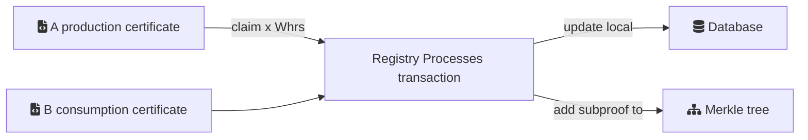
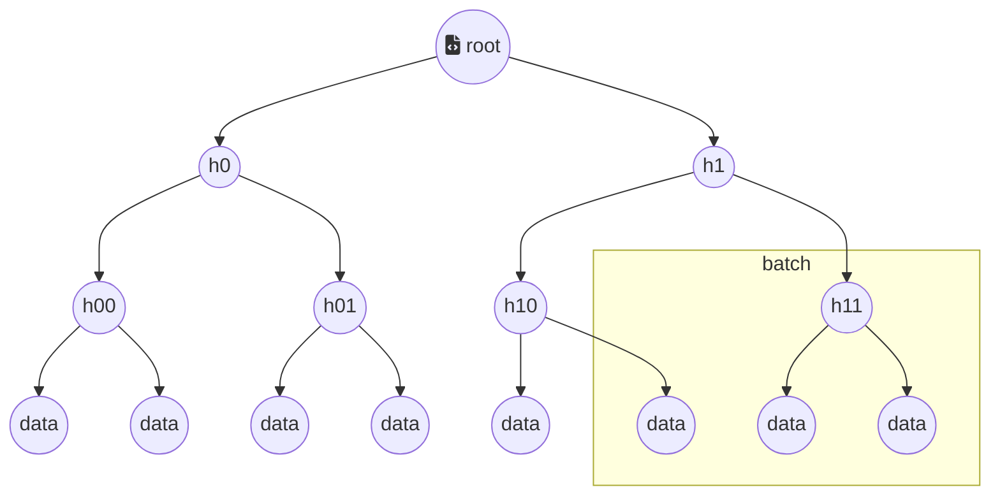

# Unique proofs using tries / merkle proofs

A unique digital proof is prerequisite for claims and immutability of certificates.

## Patlet

Through a session of workshops we have found a theoretical approach to an implementation giving us the ability to obtain unique claims using proofs / subproofs for a batch of data transactions per registry.

## Problem

The problem is that digital copies cannot be distinguished from their original counterparts. 
Using a cryptographic method, however, we should be able to prove uniqueness of a claim, thus mitigating double spending, -issuance and -claims. The solution will be  generic and subsequently applied to the Energy Track and Trace problem space.

## Story

In order to facilitate making claims of energy a digital asset with unique claims at scale, we are faced with a set of challenges that must be addressed in order to achieve a production-ready, scalable solution.

We have conducted research in tries / merkle tree structures in order to be able to locally batch a set of transactions involving issuance of production and consumption certificates and the subsequent claims on these certficates. 

To facilitate loose coupling between the processes of validation, each registry will have to process a trie per batch of transactions and then publish them, to prove that the underlying data has not been changed. 
The trie has a root hash that will change by any change in the underlying dataset, and hence the trie is not only a verification of the dataset, it can also contain subproofs that consumers can present validating their claims without disclosing information about the consumption, value, origin etc, but as a purely verifiable cryptographic proof to third-parties.

## Context

Uniqueness is achievable in closed systems with a single ruling body controlling the infrastructure. As the Energy Track and Trace infrastructure is a highly decoupled multiparty system it is of utmost importance that the participating organisation can provide trustworthiness by other means than authority and agreements. The uniqueness property requires that all participating members are publishing proof of operations concurrently with the ETT network, this problem can only be addressed computationally by using cryptographic proofs that can be validated by other parties in the network.

## Forces
Uniqueness is a scarse property in the realm computing hence a copy cannot be distinguished from its original in the digital world.
Cryptographic methods can validate inclusion in a dataset by using tries, that hashes each component in the trie and it is reflected in the root of the trie - that will change on any change in its underlying data.
Multi party systems usually rely on legal agreements - by shifting focus into computationally proving uniqueness and soundness a batch of transactions can be validated for proof of inclusion and of persistance by publishing the root of the trie when finalizing a batch of transactions.
Having an eventually consistent solution that publishes the internal changes in the registry, gives other parties in the network the ability to validate the soundness of the registry itself, and the end-users the ability proof the soundness of their claims using the same trie root.
Publishing all the data involved in the transaction would give legal impediments to ETT group and expose sensitive information about the users - cryptographic hashing of the data mitigates this issue.

## Sketch (optional)

## Solutions
The merkle tree datastructure is promising in several ways and is in production for validation on blockchains such as ethereum that utilizes [Patricia Merkle Trees](https://ethereum.org/en/developers/docs/data-structures-and-encoding/patricia-merkle-trie/). The ethereum solution is in production and is used to validate transactions in a block to verify whether the transaction is included in the current block, by having shallower cryptographic proofs and subproofs there is no immediate need of going through the full block of transactions in the block.  

This means that Merkle trees and their derivations has the utlity that they can batch transactions and by using the root can verify inclusion or not in the tree itself. This feature gives us the ability to batch large amount of transactions into a singled hashed value that can be published to validate the individual transactions and that the underlying data has not been changed in any way after its publication.

The registry will thus consist of two loosely coupled mechanisms, a conventional database and a trie for validation of the transacations on the database. A batch of transactions can thus be appended the trie - for the proof of concept trie will consist of 2^20 entries approximately a million entries, will be available per batch for a registry before it will be published. There could be a timer that closes the batch if the transaction volume makes finalization an issue, the trie size could also be a variable determined by the number of users on the registry. 

After a batch is processed by the registry - be it by time or by reaching the limit of the tree storage space the hash of the root of the trie can then be published and used for validating subproofs. The end-user can hence look up the root in a log, at a blockchain, etc. and validate their energy consumption using the trie root as input to a subproof validation mechanism.

A proof has 3 ways of being validated using this structure:
- Get(path, tree_id ) - the user provides the path and recovers the root from the tree_id and has a subproof of inclusion in that specific trie, that is validated as true or false
- Merkleproof([1,2,...20]) - A Registry [serverside] function that returns the merkleproof to the user that can verify themselves that the hashes on the path is included in the root.
- Verify(merkleproof, path) - a client function [clientside] recursive function that locally can compute and verify the soundness of the proof using the merkleproof from the registry by looping through the path and validating the subproof or by looping through all hashes and producing the root hash that can be validated against the published trie-root.
## Resulting Context

## Rationale 
Patricia Merkle trees can be validated by calling a function with a path and trie. The root hash can show inclusion by applying the path to verify whether or not there is a value on the path. This means that a unique subproof can be provided to the user as a means of delivery of the claims, as such a mechanism can be proof of delivery - that initiates the agreed payment for the transaction of the claims on the digital assets - in the case of ETT claims on production and consumption certificates.

It has to be noted to prove that the certificates has not been changed or tampered with they must be included in the merkle tree upon issuance.

There is a different approach to compress the proofs called verkle trees, that uses vector commitments as described by [Kurszmaul, 2018](https://math.mit.edu/research/highschool/primes/materials/2018/Kuszmaul.pdf) and appropriated by the [ethereum foundation](https://blog.ethereum.org/2021/12/02/verkle-tree-structure/) to achieve smaller proofs for the validators in their network. Verkle trees are more efficient in terms of space and computation but are not as flexible as the merkle trees or Patricia Merkle trees - and are not quantum safe as the hashing implementations. 

Hence the use of Patricia Merkle trees is the preferred implementation option.

## Known Instances 
- [Patricia Merkle Trees](https://ethereum.org/en/developers/docs/data-structures-and-encoding/patricia-merkle-trie/)
- [ProvenDB](https://docs.proofable.io/concepts/chain_of_trust.html)
- [AERGO tries](https://github.com/aergoio/aergo/tree/master/pkg/trie)
- [Modified Merkle tree - medium.com article "how ethereum saves state"](https://medium.com/codechain/modified-merkle-patricia-trie-how-ethereum-saves-a-state-e6d7555078dd)
- [IOTA implementation of tries using a Key Value store (badger.db)](https://github.com/iotaledger/trie.go)
- [CCF Confidential Consortium Framework](https://microsoft.github.io/CCF/main/overview/what_is_ccf.html)

## Author(s) 

- Thomas Wisbech, @wisbech 
- Martin Schmidt, @MartinSchmidt 

## Acknowledgements 

We are grateful for the input and work from 
- Torben Pryds Pedersen, Concordium
- Morten Jochumsen, Mjølner Informatics

## Alias

- Patricia Merkle Tree
- Tries
- Sparse Merkle trees
