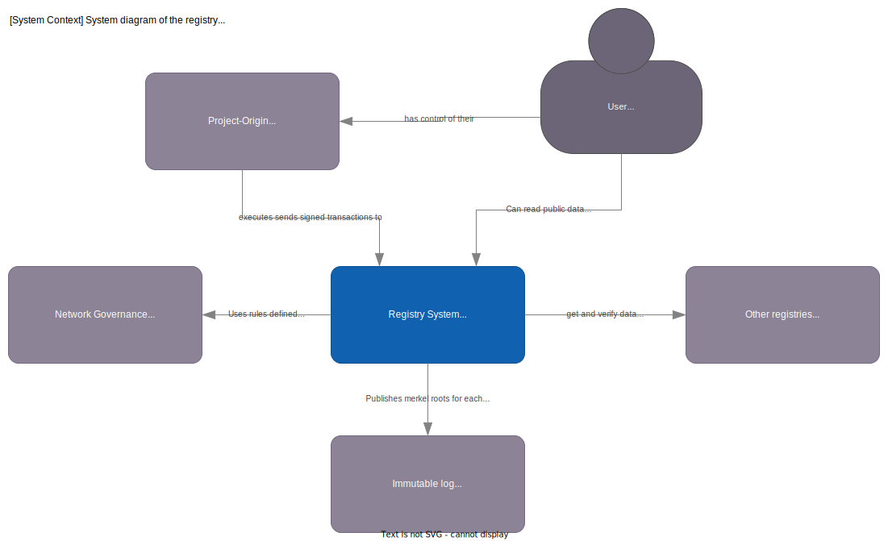

# Overview

This file contains a overview of the registry.

## Glossary

- **Transactions**: are request to change data on the registry. A transaction is signed by a valid key.
- **Stream**: are sequences of transactions for a specific  are state changes that has happened and are persisted when they have been included in a merkle tree.
- **Event store**: a datastore that stores all the events for the registry.

## Overview

Below is a [system context diagram](https://c4model.com/#SystemContextDiagram)
showing the landscape of systems the registry interacts with.

### What is the registry?

In ProjectOrigin a registry is a single node in the federated network.

A Registry main responsibility is to ensure the rules of the network are applied to the data it holds,
and provide a tamper-evident[^tamper] log of all changes to the data.

[^tamper]: Tamper-evident ensures it is possible to detect if the data has been changed, but cannot prevent it.
Any system can be tampered with, but the goal is to make it detectable and hold the hosting part accountable.

Each registry can hold any number of [GCs](../concept/granular-certificates/readme.md).
It is up to the issuing body[^ib] to specify which registry to put a GC on
at the time of issuance with the help of the [Federated Certificate ID](../concept/granular-certificates/federated-certifate-id.md).

[^ib]: The issuing body is the entity that has the legal right to issue GCs within a given area.

The life-cycle of a single GC always stays within the same registry as to ensure atomic operations on the GC
and reduce the need for distributed transactions.

In practice this makes each registry the authority of what is the truth for the current state of a GCs held within it.

Some transactions like [claim](../concept/granular-certificates/transactions/claim.md)
does span multiple registries, but are performed as a distributed transaction using a saga pattern.

### The registry is neither strongly typed nor context-aware

The registry is not context-aware, which means that it does not know anything about the data it stores.
It is up to the user of the registry to interpret the data. The registry only hashes the data.
The registry does not know what the data means, or how it should be interpreted, all it does is to verify provide proofs of the data.

The reason why the registry is not strongly typed or context aware is that it allows for greater flexibility and applicability across different use cases and industries.

For example, a strongly typed registry would require a specific data schema or format for each type of event being stored, which could be limiting for organizations with diverse data structures. A context-aware registry would also require additional configuration and setup to define the specific context for each use case.

By not being strongly typed or context aware, the registry can be used in a multitude of different contexts without requiring significant customization or configuration. This makes it a more versatile and generic method of implementing traceability.

In addition, the registry provides unique proof of ownership for events added to the event store, and can be used to ease audits from third parties without disclosing the data itself. These benefits remain true regardless of the specific context in which the registry is being used.

Overall, while a strongly typed or context-aware registry may be useful in some specific scenarios, the flexibility and versatility of a more generic registry can make it a more practical solution for many organizations.

