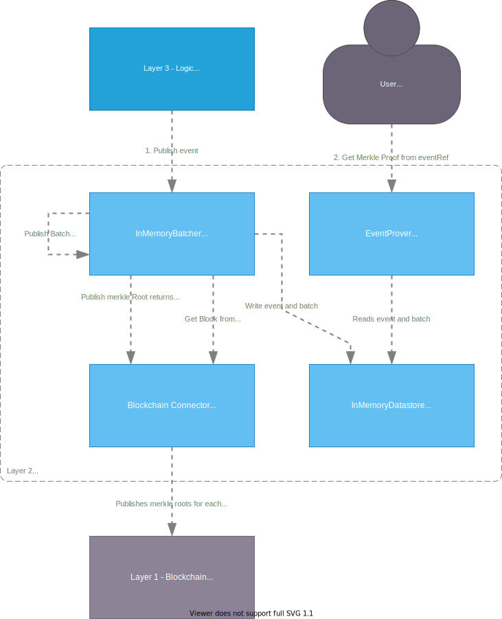

# Verifiable Event Store

The verifiable event store container has the responsibility to store events as public date.

It arranges them in a series of merkle-treens, where each root is published in series to a blockchain,
this ensures it is tamper proof after the root has been published.

The container also has the responsibility to calculate MerkleProofs as requested by users,
so they can verify their data is part of the tree.

In future is should be posible to get all data stored, so one can follow all changes,
and verify no illegal operations is done.



## Component

### Batcher

Should be configured with parameter BatchSizeExponent, this is used with 2^BatchSizeExponent,
which defines the maximum size of the tree, escalating an automatic publish batch when events are added.
It is does as an exponent of 2 to ensure a balanced-tree.

When a batch is being publishes, a new batch to begin collecting events are created.

Hashing is done with SHA256.

## Endpoints

### 1. PublishEvent(VerifiableEvent)

Takes a VerifiableEvent to store in the merkle tree,
the batcher ensures that the EventId is Unique,
and in sequense.

```protobuf
message VerifiableEvent {
  EventId Id = 1;
  bytes Content = 2;
}

message EventId {
  Uuid EventStreamId = 1;
  uint32 Index = 2;
}
```

### 2. GetMerkleProof(EventId)

Takes an EventId as used in the PublishEvent,
finds the event based on the id, and calculates and returns a MerkleProof,
which enables a user to validate the event is part of the tree on the blockchain.

```protobuf
message MerkleProof {
  EventId EventId = 1; // id of the event
  bytes Event = 2; // content of the event
  string BlockID = 3; // Blockchain block reference
  string TransactionID = 4; // Blockchain transaction reference
  int64 leafIndex = 5; // leaf number in the tree, zero based.
  repeated string hashes = 6; // Hashes needed to calculate the root based on the event.
}
```
